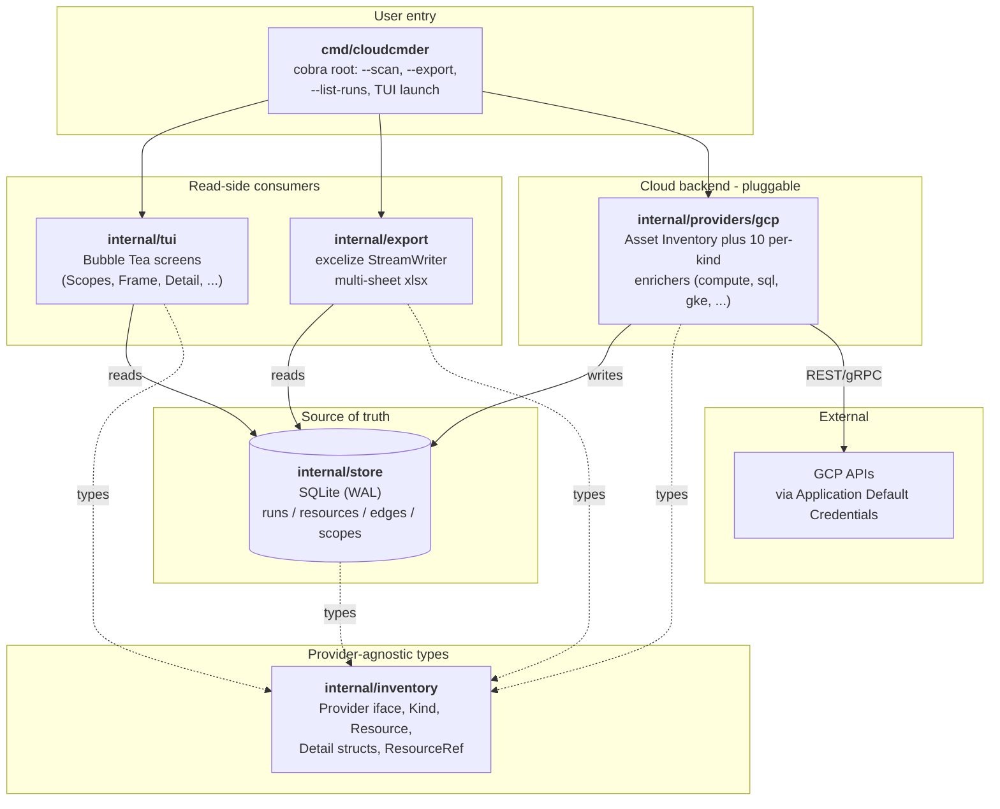
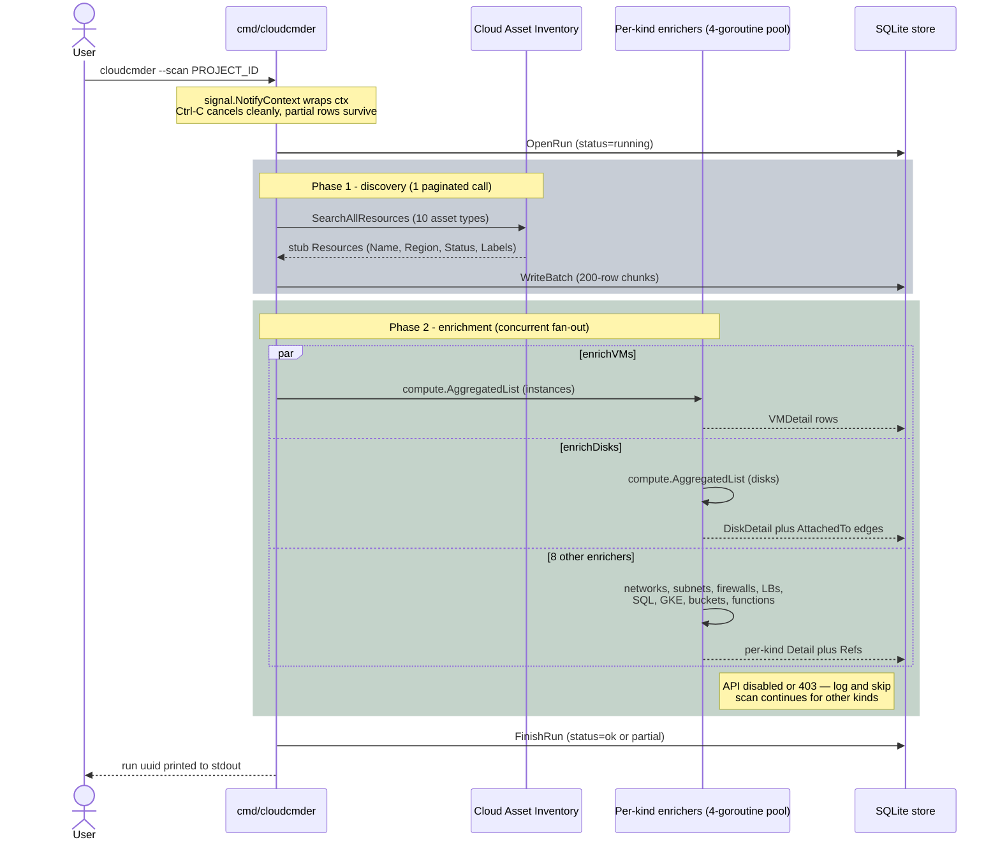
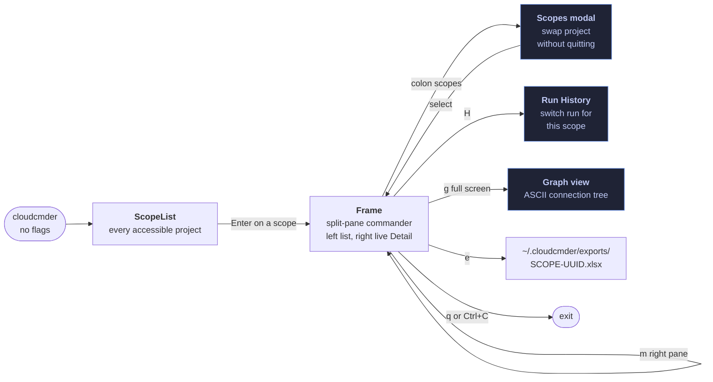

# cloudcmder

> **A k9s-style TUI for cloud asset inventory.** Scan a GCP project, browse
> resources by kind, drill into details, follow connections, export to
> Excel — entirely from the terminal.

[](https://github.com/kontinuity-io/cloudcmder/actions/workflows/ci.yml)

Single static binary. Runs anywhere — CloudShell, your laptop, an audit
workstation. No database to install. No SQL to write. No credentials to
copy: cloudcmder reads via Application Default Credentials.

## Features

- 🔍 **Headless scan** — one command pulls VMs, disks, networks, subnets,
  firewalls, load balancers, Cloud SQL, GKE clusters, buckets, and Cloud
  Functions / Cloud Run. ~5 s on a typical 80-resource project.
- 📊 **Commander TUI** — k9s/lazydocker split-pane: a kind-typed resource
  list on the left, live Detail rebuild on the right as you move the
  cursor. `:` opens a fuzzy palette over kind aliases AND every resource
  in the run.
- 🔗 **Interconnections** — VM ↔ Disk ↔ Subnet edges captured during the
  scan; ASCII connection-tree (`g`) per resource.
- ⚡ **Concurrent enrichment** — 4 per-kind goroutines fan out under a
  semaphore so a 100-resource project scans in ~5 s.
- 📑 **Excel export** — one sheet per kind plus Summary; `excelize`
  streams rows so memory stays bounded on CloudShell.
- 🔒 **Read-only.** cloudcmder calls list-only GCP APIs and never modifies
  resources or stores credentials — ADC is the only auth path.
- 💾 **Portable SQLite store** — every scan is a row in
  `~/.cloudcmder/cloudcmder.db`; copy the file out for offline analysis
  or audit replay.

## How it works

cloudcmder is layered: **a TUI / CLI / exporter on top, a SQLite store
in the middle, a per-cloud Provider at the bottom.** Scans write through
the store; the TUI and exporter read from it. The TUI never talks to GCP
directly — that decouples interactive browsing from network calls.



The dashed lines are import-only relationships; the solid lines are
runtime data flow. **`internal/tui` and `internal/export` never import
`internal/providers/*`** — that rule is enforced by a depguard test
(`internal/tui/depguard_test.go`) and by the layering itself.

### Scan flow

A `--scan` runs in two phases. Phase 1 is a single Cloud Asset Inventory
listing that produces stub rows for every supported kind. Phase 2 fans
out per-kind enrichers (4-goroutine semaphore) that fill in `Detail`
fields and `Refs` (interconnection edges).



A typical 80-resource project completes in ~5 s on a 100 Mbps connection.

### TUI navigation

The TUI is a **commander dashboard** (k9s/lazydocker style) — a
persistent split-pane Frame with a list on the left and a live Detail
on the right. Modals (Scopes, RunHistory, full-screen Graph) push above
the Frame; `Esc` walks back through the left-pane history *inside* the
Frame; `q` is the only way out.



The right-pane Detail rebuilds as the cursor moves over the resource
list. `m` cycles its mode: **Detail / ConnectionsOnly / RawJSON /
InlineGraph**. The fuzzy palette (`:`) matches kind aliases AND every
resource name in the run; picking a resource lands the cursor on it.

## Quickstart

### Build from source

The released binary ships with v1.0.0 (M9 milestone). Until then, build from source:

```sh
# Prereqs: Go 1.25+, gcloud CLI (for credentials)
git clone https://github.com/kontinuity-io/cloudcmder
cd cloudcmder

# 1. Authenticate to GCP via Application Default Credentials.
#    Skip this step inside CloudShell — ADC is already set up.
gcloud auth application-default login

# 2. Build a static binary (CGO_ENABLED=0 keeps modernc.org/sqlite happy
#    and produces a portable binary you can copy anywhere).
CGO_ENABLED=0 go build -o cloudcmder ./cmd/cloudcmder

# 3. Verify auth — prints every project the credential can see, as JSON.
./cloudcmder --list-scopes

# 4. Scan a project (writes ~/.cloudcmder/cloudcmder.db).
./cloudcmder --scan <your-project-id>

# 5. Browse the scan in the commander TUI.
./cloudcmder
```

### Release binary (post-v1.0.0)

Once v1.0.0 ships you can skip the build step:

```sh
curl -Lo cloudcmder https://github.com/kontinuity-io/cloudcmder/releases/latest/download/cloudcmder_linux_amd64.tar.gz \
  | tar -xzO cloudcmder > cloudcmder && chmod +x cloudcmder
./cloudcmder --scan <your-project-id>
./cloudcmder
```

### Day-to-day usage

```sh
# Refresh data — re-run the scan whenever you want a fresh snapshot.
# (Typically completes in ~5s; the 10 enrichment phases run concurrently
#  with a 4-goroutine cap.)
./cloudcmder --scan my-project

# Inspect the runs the store has (no GCP calls).
./cloudcmder --list-runs

# See the kind/count breakdown for a specific run.
./cloudcmder --show-run <uuid>

# Open the TUI on a different db (e.g. one a teammate shared).
./cloudcmder --db /path/to/their.db

# Power-user: query the SQLite directly.
sqlite3 ~/.cloudcmder/cloudcmder.db "SELECT kind, COUNT(*) FROM resources GROUP BY kind;"

# Export the most recent run to a multi-tab .xlsx for analysts/auditors.
./cloudcmder --export ~/Desktop/assessment.xlsx

# Export a specific run by uuid.
./cloudcmder --export /tmp/old-snapshot.xlsx --run a5f1880b-8225-4ab1-915e-8461f6a21ee8
# (Inside the TUI, press `e` to export the current run to
#  ~/.cloudcmder/exports/<scope>-<short-uuid>.xlsx.)
```

> **First-run gotcha:** if your project has APIs disabled (e.g. Cloud Functions or GKE never used), the scan logs a warning per kind and skips it. The rest of the scan still completes. To enrich every kind, enable the corresponding API once via the Cloud Console or `gcloud services enable …`.

## Required IAM roles

Assign these roles to the account you use with `gcloud auth application-default login`:

| Role | Purpose |
|---|---|
| `roles/viewer` | Read most resource types (compute, sql, gke, run, cloud functions, storage list) |
| `roles/cloudasset.viewer` | Cloud Asset Inventory discovery (covers VertexAI stub listing via `aiplatform.*` asset types) |
| `roles/storage.legacyBucketReader` *(optional)* | Accurate `PublicAccess` on Cloud Storage buckets — without it, the IAM check is skipped and buckets default to `PublicAccess=false` |
| `roles/aiplatform.viewer` *(optional, future)* | Reserved for a future Phase-2 Vertex enricher; not required for current stub-only listing |

> Read-only. cloudcmder never modifies resources. The list of APIs that must be enabled on the target project is in [Troubleshooting](#troubleshooting); a disabled API is logged as a warning and that kind is skipped — the rest of the scan still completes.

## Keybindings

| Key | Action |
|---|---|
| `Enter` | On a kind row: open that kind's resource list in the left pane. On a resource row: zoom Detail to full width. |
| `Esc` | Unzoom Detail; walk back through left-pane history; close a modal. No-op at the root pane — `q` is the only way out of the Frame. |
| `Tab` | Cycle focus between the list (left) and detail (right) panes |
| `q` / `Ctrl+C` | Quit (always wins, even with the cmdbar open) |
| `?` | Toggle contextual help |
| `/` | Fuzzy filter the current list. Matches across name, region, status, and labels; rows reorder by best-score-first. Matched runes bolded+underlined in the NAME cell. |
| `:` | Open the fuzzy palette. Type a kind alias (`vm`, `bucket`, …), a resource name, or `scopes`; ↑/↓ to pick, Enter to commit. Resource picks swap the left pane and land the cursor on the match. |
| `:vm` `:disk` `:db` `:lb` `:net` `:subnet` `:fw` `:bucket` `:gke` `:fn` | IaaS/platform kind aliases — swap left pane to that kind's resource list |
| `:vertex` `:apigee` `:firebase` `:bq` `:pubsub` `:kms` `:secrets` `:bigtable` `:spanner` `:dataflow` `:dataproc` `:composer` `:scheduler` `:tasks` `:monitoring` `:logging` `:osconfig` `:vpn` `:router` `:build` `:dns` `:memorystore` `:appengine` `:ar` | Stub-only Kind aliases |
| `:scopes` | Open ScopeList as a modal over the current Frame — pick a different project without `q` and relaunch |
| `j` / `k` | Move cursor down / up (vim alias for ↓ / ↑) |
| `g` / `G` | Jump cursor to top / bottom of the list (vim) |
| `Ctrl+u` / `Ctrl+d` | Half-page scroll up / down (vim) |
| `s` | Cycle sort: column 0 asc → desc → column 1 asc → desc → … → no sort. Active only when the `/` filter is empty. |
| `m` | (in right pane) Cycle Detail mode: Full → Connections-only → Raw JSON → Inline Graph |
| `g` | (in right pane via global) Open the full-screen ASCII connection-graph for the focused resource |
| `H` | Run history modal — pick a different run for this scope |
| `e` | Export current run to Excel — lands in `~/.cloudcmder/exports/<scope>-<short-uuid>.xlsx` |
| `R` | Start a new scan from inside the TUI *(deferred — use `--scan` from CLI for now)* |

## CLI flags

```
cloudcmder [flags]

Flags:
  --db string             SQLite assessment database path (default ~/.cloudcmder/cloudcmder.db)
  --log-level string      debug, info, warn, error (default info)
  --check                 check that required GCP APIs are enabled (read-only; exits non-zero if any missing)
  --project string        limit --check to a single project ID (default: all accessible projects)
  --list-scopes           list every accessible GCP project as JSON and exit
  --scan string           headless scan of a single project; prints the run uuid on completion
  --scan-all              scan every accessible GCP project sequentially (one run per project)
  --scan-projects string  comma-separated list of project IDs to scan sequentially
  --fail-fast             abort --scan-all/--scan-projects on the first error (default: continue)
  --list-runs             list every stored run as a table
  --show-run string       print resource counts grouped by kind for the given run uuid
  --export string         write a multi-tab Excel workbook for a single stored run
  --run string            run uuid to export (with --export); defaults to the most recent run
  --export-multi string   write a combined multi-project workbook to the given path
  --runs string           comma-separated run UUIDs to include in --export-multi
  --scopes string         comma-separated scope IDs for --export-multi (latest run per scope)
  -v, --version           print version
```

### Preflight check

Before your first scan, run `--check` to verify every required GCP API is
enabled in your target projects:

```sh
cloudcmder --check                        # all accessible projects
cloudcmder --check --project my-proj-123  # single project
```

Example output when APIs are missing:

```
Project: my-proj-123
  Required: 32  Enabled: 26  Missing: 6
    - apigee.googleapis.com
    - bigtableadmin.googleapis.com
    - cloudkms.googleapis.com
    - composer.googleapis.com
    - dataflow.googleapis.com
    - secretmanager.googleapis.com

  To enable missing APIs:
    gcloud services enable apigee.googleapis.com bigtableadmin.googleapis.com cloudkms.googleapis.com composer.googleapis.com dataflow.googleapis.com secretmanager.googleapis.com --project=my-proj-123
```

Exits 0 when all APIs are present, non-zero when any are missing — composable
with `&&`: `cloudcmder --check && cloudcmder --scan my-proj-123`.

The required-API list is derived at runtime from cloudcmder's internal
`assetTypeToKind` map, so it always matches the scan code exactly. The
`gcloud services enable …` block in this README is the static equivalent;
use `--check` for the live diagnostic.

The interactive TUI is shipped — invoke `cloudcmder` with no flags.

### Scanning multiple projects

To capture your entire GCP estate in one go:

```sh
# 1. Preflight — verify APIs are enabled across all projects (optional but recommended)
cloudcmder --check

# 2. Scan every accessible project sequentially (one run row per project)
cloudcmder --scan-all

# 3. Export a single combined workbook covering all projects
cloudcmder --export-multi ~/Desktop/full-inventory.xlsx
```

Output while scanning:

```
scanning 5 project(s)…
[1/5] proj-prod-1 … ok (run a1b2c3d4-…)
[2/5] proj-prod-2 … ok (run e5f6g7h8-…)
[3/5] proj-staging … ok (run i9j0k1l2-…)
[4/5] proj-dev … ok (run m3n4o5p6-…)
[5/5] proj-sandbox … ok (run q7r8s9t0-…)
```

The combined workbook has:

- **Summary tab** — one row per project with per-kind resource counts and a TOTAL row.
- **Per-kind tabs** (VMs, Disks, Networks, …, VertexAI, CloudBuild, etc.) — all resources from all projects, with a leading `Project` column.
- **Scopes** and **Edges** tabs — unioned across all projects.

Targeted sub-selections:

```sh
# Scan only named projects
cloudcmder --scan-projects=proj-a,proj-b,proj-c

# Export the latest run for two specific scopes
cloudcmder --export-multi ~/Desktop/two-projects.xlsx --scopes proj-a,proj-b

# Export specific runs by UUID
cloudcmder --export-multi ~/Desktop/custom.xlsx --runs uuid1,uuid2,uuid3

# Abort on first failure (default is continue)
cloudcmder --scan-all --fail-fast
```

Each project's scan is independent: a failure in one project (e.g. missing
APIs) is logged as a warning and the loop continues to the next project.
Exit code is non-zero when any project failed. Already-completed project
runs survive a Ctrl-C mid-loop — the scan can be re-run for just the
failed ones with `--scan-projects`.

## FAQ

**Does it work offline?** No — cloudcmder calls Cloud Asset Inventory and
several per-kind GCP APIs during a scan. After a scan, the TUI reads
purely from the local SQLite database, so browsing prior runs needs no
network.

**Where does it store credentials?** It doesn't. Authentication uses
Application Default Credentials (ADC) — the same mechanism `gcloud` uses.
cloudcmder never touches `~/.config/gcloud/`.

**Which clouds are supported?** GCP in v1.0. AWS is the v2 milestone; the
provider abstraction (`internal.inventory.Provider`) is designed to land
new clouds without changes to the store, TUI, or exporter.

**Where does the database live? Is it safe to share?** A single SQLite
file at `~/.cloudcmder/cloudcmder.db`. It contains resource metadata
your credentials could already see (no secrets); copy it out of
CloudShell after a scan if you want to keep it. `--db /path/to/file.db`
overrides the default.

**How do I run a scan from CloudShell?** See [Quickstart](#quickstart).
The `~/.cloudcmder/cloudcmder.db` lives in CloudShell's ephemeral home
directory, so download it (`Downloads` panel) before the session ends if
you want it.

## Development status

| Milestone | Status |
|---|---|
| M0 Skeleton | ✅ |
| M1 Inventory types + GCP auth | ✅ |
| M2 SQLite store + headless scan | ✅ |
| M3 Bubble Tea TUI shell | ✅ |
| M4 Overview screen | ✅ |
| M5 VM detail + interconnections | ✅ |
| M6 All resource kinds | ✅ |
| M6.5 Commander layout (split-pane, live detail) | ✅ |
| M7 Excel export | ✅ |
| M8 Concurrency + polish | ✅ |
| v1.1 Fuzzy command palette | ✅ |
| v1.2 TUI polish (lazydocker-rich) | ✅ |
| M9 Release v1.0.0 | 🔲 |
| M9.5 Charm v2 upgrade | 🔲 |
| v1.3 Telemetry overlay | 🔲 |

See `plan.md` for full milestone details and acceptance criteria.

## Troubleshooting

### Enable the GCP APIs cloudcmder reads

Each Kind needs its provider API enabled on the target project. A disabled API isn't fatal — the scan logs a warning and skips that kind — but for full enrichment, enable all of them:

```sh
PROJECT=<your-project-id>
gcloud services enable \
  cloudresourcemanager.googleapis.com \
  cloudasset.googleapis.com \
  compute.googleapis.com \
  sqladmin.googleapis.com \
  container.googleapis.com \
  storage.googleapis.com \
  run.googleapis.com \
  cloudfunctions.googleapis.com \
  aiplatform.googleapis.com \
  apigee.googleapis.com \
  firebase.googleapis.com \
  appengine.googleapis.com \
  bigquery.googleapis.com \
  dns.googleapis.com \
  redis.googleapis.com \
  memcache.googleapis.com \
  artifactregistry.googleapis.com \
  cloudscheduler.googleapis.com \
  pubsub.googleapis.com \
  spanner.googleapis.com \
  bigtableadmin.googleapis.com \
  cloudkms.googleapis.com \
  secretmanager.googleapis.com \
  dataflow.googleapis.com \
  dataproc.googleapis.com \
  composer.googleapis.com \
  cloudtasks.googleapis.com \
  monitoring.googleapis.com \
  logging.googleapis.com \
  osconfig.googleapis.com \
  cloudbuild.googleapis.com \
  --project=$PROJECT
```

Only enable APIs for services you actually use — disabled APIs produce 0 rows for that Kind (logged as a warning, scan continues).

| API | cloudcmder Kind |
|---|---|
| `cloudresourcemanager.googleapis.com` | (scope listing — `--list-scopes`) |
| `cloudasset.googleapis.com` | Phase 1 discovery for all Kinds |
| `compute.googleapis.com` | VM, Disk, Network, Subnet, Firewall, LoadBalancer, VPN, Router |
| `sqladmin.googleapis.com` | Database |
| `container.googleapis.com` | Cluster |
| `storage.googleapis.com` | Bucket |
| `run.googleapis.com` | Function (Cloud Run) |
| `cloudfunctions.googleapis.com` | Function (Cloud Functions) |
| `aiplatform.googleapis.com` | VertexAI (stub) |
| `apigee.googleapis.com` | Apigee (stub) |
| `firebase.googleapis.com` | Firebase (stub) |
| `appengine.googleapis.com` | AppEngine (stub) |
| `bigquery.googleapis.com` | BigQuery (stub) |
| `dns.googleapis.com` | DNS (stub) |
| `redis.googleapis.com` / `memcache.googleapis.com` | Memorystore (stub) |
| `artifactregistry.googleapis.com` | ArtifactRegistry (stub) |
| `cloudscheduler.googleapis.com` | CloudScheduler (stub) |
| `pubsub.googleapis.com` | PubSub (stub) |
| `spanner.googleapis.com` | Spanner (stub) |
| `bigtableadmin.googleapis.com` | Bigtable (stub) |
| `cloudkms.googleapis.com` | KMS (stub) |
| `secretmanager.googleapis.com` | SecretManager (stub) |
| `dataflow.googleapis.com` | Dataflow (stub) |
| `dataproc.googleapis.com` | Dataproc (stub) |
| `composer.googleapis.com` | Composer (stub) |
| `cloudtasks.googleapis.com` | CloudTasks (stub) |
| `monitoring.googleapis.com` | Monitoring (stub) |
| `logging.googleapis.com` | Logging (stub) |
| `osconfig.googleapis.com` | OSConfig / VM Manager (stub) |
| `cloudbuild.googleapis.com` | CloudBuild (stub) |

To turn them off again (no resources are deleted; the project just loses API access):

```sh
gcloud services disable \
  cloudasset.googleapis.com \
  compute.googleapis.com \
  sqladmin.googleapis.com \
  container.googleapis.com \
  storage.googleapis.com \
  run.googleapis.com \
  cloudfunctions.googleapis.com \
  --project=$PROJECT
```

> `cloudresourcemanager.googleapis.com` is intentionally omitted from the disable list — disabling it can lock you out of project metadata. Leave it on.

### Common issues

- **`--list-scopes` returns nothing** — your ADC credential can't see any projects. Re-auth with `gcloud auth application-default login`, or check `gcloud projects list` returns at least one project.
- **`PermissionDenied: API has not been used in project …`** — that one API isn't enabled. The scan continues for the other kinds; enable the API per the table above and re-scan.
- **All `Function` rows have empty Detail** — both `run.googleapis.com` and `cloudfunctions.googleapis.com` need to be enabled (Cloud Run + Cloud Functions Gen2 both back the `Function` kind).
- **Bucket `PublicAccess` always shows `no`** — your credential lacks `storage.buckets.getIamPolicy`. Grant `roles/storage.legacyBucketReader` (or any role including that permission) and re-scan. Without it cloudcmder defaults to "not public" to avoid false alarms.
- **TUI rendering looks corrupted** — check `~/.cloudcmder/cloudcmder.log`. Debug output is routed there so it can't trash the alt-screen; if anything went sideways the trace is in that file.
- **Stuck on `loading…` forever** — usually a slow GCP API call. `q` to quit cleanly, then `tail ~/.cloudcmder/cloudcmder.log`.
- **Start fresh** — `rm ~/.cloudcmder/cloudcmder.db` deletes every stored run; the next `--scan` rebuilds from scratch.
- **Open the SQLite directly** — `sqlite3 ~/.cloudcmder/cloudcmder.db`. Schema is documented in `architecture.md`.

## Architecture

See `architecture.md` for the full design: layer diagram, Provider interface, SQLite schema, GCP API choices, TUI screen flow, Excel layout, and the multi-cloud extension guide.

## Contributing

See `CLAUDE.md` for coding standards, the dependency rules between layers, and checklists for adding new resource kinds or cloud providers.

## License

Apache-2.0 — see [LICENSE](LICENSE).
